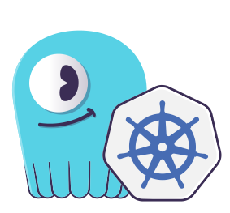

# Scylla Operator

[Scylla Operator](https://github.com/scylladb/scylla-operator) is a Kubernetes Operator for managing and automating tasks related to managing ScyllaDB clusters.

[ScyllaDB](https://www.scylladb.com) is a close-to-the-hardware rewrite of Cassandra in C++. It features a shared nothing architecture that enables true linear scaling and major hardware optimizations that achieve ultra-low latencies and extreme throughput. It is a drop-in replacement for Cassandra and uses the same interfaces.

## Documentation

ScyllaDB Operator documentation is available on https://operator.docs.scylladb.com. It's the best place to start learning
about the Operator, its features, and how to use it.

## Deploying the Operator

Please refer to the [Installation](https://operator.docs.scylladb.com/stable/installation/index.html) section of our documentation
to learn how to deploy ScyllaDB Operator in your Kubernetes cluster.

You can also check out our [ScyllaDB University lesson](https://university.scylladb.com/courses/scylla-operations/lessons/kubernetes-operator/) to learn more about the Operator and how to use it.
The lesson includes some hands-on examples which you can run yourself.

## Releases

To find out more about our releases and support matrix, please refer to the [Releases](https://operator.docs.scylladb.com/stable/support/releases.html) documentation page.

## Support

If you find a bug please file an [issue](https://github.com/scylladb/scylla-operator/issues) for us.

We are also available on `#scylla-operator` channel on [Slack](https://scylladb-users.slack.com) if you have questions.

## Contributing
We would **love** you to contribute to Scylla Operator, help make it even better and learn together! Have a look at the [Contributing Guide](CONTRIBUTING.md) or reach out to us on `#scylla-operator` channel on [Slack](https://scylladb-users.slack.com/) if you have questions.
