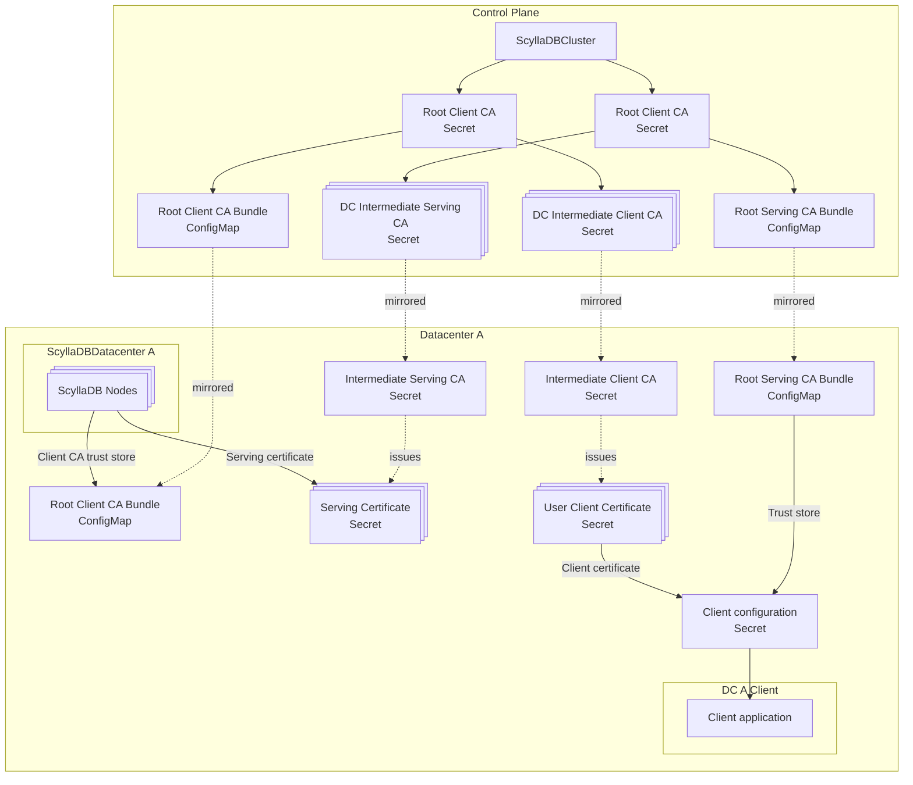

# Client-to-node TLS in multi datacenter deployments

## Summary

This proposal aims at introducing support for ScyllaDBCluster client-to-node TLS.

## Motivation

Currently, ScyllaDBCluster does not support enabling TLS for client-to-node communication across multiple datacenters.
This limitation arises because each datacenter independently reconciles its own certificate authority, resulting in
certificates that are not trusted across datacenters. As a consequence, it is not possible to establish secure,
encrypted connections between clients and nodes in different datacenters using a unified trust model.

This proposal aims to address this gap by introducing a mechanism to inject and synchronize separate serving and client CAs
across all datacenters. The control plane (ScyllaDBCluster) will issue two Intermediate CAs: one for serving and one for 
client authentication - for each datacenter. These Intermediate CAs will be mirrored into their respective
datacenters and used to sign certificates for their specific purposes, ensuring mutual trust and enabling secure TLS communication
cluster-wide.

Due to the current lack of this capability, existing users of ScyllaDBCluster are forced to use unencrypted
client-to-node traffic in multi-datacenter deployments, or setting up the chain manually.

### Goals

- Propose the required API changes in `ScyllaDBCluster` and `ScyllaDBDatacenter` to support Intermediate CAs and custom trust stores.
- Outline the chain of trust for certificate issuance.
- Ensure that the solution enables secure, encrypted client-to-node communication across all datacenters.
- Maintain backward compatibility for users not requiring multi-datacenter TLS.

### Non Goals

- do not address changes to rack-level certificates - they will continue to be managed as they are today, 
  without splitting them into per-node certificates.
- do not address missing TLS layer other than CQL client-node connections.

## Proposal

Both the `ScyllaDBCluster` and `ScyllaDBDatacenter` APIs will be extended with fields to provide user-specified references 
to `Secrets` and `ConfigMaps` containing the Client and Serving CA TLS certificates, as well as references to custom CA bundles used as trust stores.
This enhancement will allow users to either supply their own CA certificates for each purpose via `Secrets` or, if not provided,
have the operator generate self-signed CAs automatically.

Those Intermediate CAs together with Root CA Bundles are going to be mirrored into each datacenter.

Clients connecting to any datacenter should trust the CA bundle specified in the `ScyllaDBCluster`. As a result, they
will trust every certificate signed by each datacenter. Because CA Bundle it's going to be mirrored into each datacenter,
clients running there will have access to it. 

### User Stories

#### User provided CA

As a user of a multi-datacenter `ScyllaDBCluster`, I want to provide my own organization-wide CA for client-to-node
TLS, so that all datacenters use certificates signed by the same trusted authority and clients can securely connect to
any datacenter using a single CA bundle.

#### Operator managing entire chain

As a user deploying a new `ScyllaDBCluster` across multiple datacenters, I want the operator to automatically generate and
synchronize a self-signed CA for client-to-node TLS, so that I can enable encrypted communication between clients and
nodes in all datacenters without manual certificate management.

#### Automatic certificate refresh

As a user of a `ScyllaDBCluster`, I want certificates managed by the Operator to be automatically refreshed before
their expiration, so that secure communication is maintained without manual intervention or risk of service disruption.

### Risks and Mitigations

#### Leak of Root CA 
When Root CA is leaked, attacker may issue trusted certificates and get cluster-wide access.  
The CA certificate's private key is never mounted in Scylla Pods, and often Control Plane is deployed in separate 
Kubernetes cluster, reducing the attack surface.
If a compromise is detected, the CA certificate can be rotated by removing the managed Secret, causing that the new certificate 
will be automatically propagated to every Scylla Pod across all datacenters, leaving leaked one no longer valid.

## Design Details

The main idea is to allow users to provide their own CA certificates and specify trust stores (or let the operator generate them), 
and ensure these are synchronized and trusted cluster-wide.

### API Changes

Both the `ScyllaDBCluster` and `ScyllaDBDatacenter` resources will be extended with new fields to reference user-supplied 
CA certificates:

ScyllaDBCluster changes:
```go

type ScyllaDBClusterCQLExposeOptionsTLS struct {
	// servingCertificateAuthority references a TLS certificate for CA issuing serving certificates.
	// +kubebuilder:default:={type:"OperatorManaged"}
	ServingCertificateAuthority *TLSCertificate `json:"servingCertificateAuthority,omitempty"`

	// clientCertificateAuthority references a TLS certificate for CA issuing client certificates.
	// +kubebuilder:default:={type:"OperatorManaged"}
	ClientCertificateAuthority *TLSCertificate `json:"clientCertificateAuthority,omitempty"`
}

// ScyllaDBClusterCQLExposeOptions hold options related to exposing CQL backend.
type ScyllaDBClusterCQLExposeOptions struct {
	// tls specifies TLS options for CQL.
	TLS *ScyllaDBClusterCQLExposeOptionsTLS `json:"tls,omitempty"`
}

// ScyllaDBClusterExposeOptions hold options related to exposing ScyllaDBCluster backends.
type ScyllaDBClusterExposeOptions struct {
	// cql specifies expose options for CQL SSL backend.
	// +optional
	CQL *ScyllaDBClusterCQLExposeOptions `json:"cql,omitempty"`
	
	[...]
}
```

ScyllaDBDatacenter changes:
```go

type CQLExposeOptionsTLS struct {
	// servingCertificateAuthority references a TLS certificate for CA issuing serving certificates.
	// +kubebuilder:default:={type:"OperatorManaged"}
	ServingCertificateAuthority *TLSCertificate `json:"servingCertificateAuthority,omitempty"`

	// clientCertificateAuthority references a TLS certificate for CA issuing client certificates.
	// +kubebuilder:default:={type:"OperatorManaged"}
	ClientCertificateAuthority *TLSCertificate `json:"clientCertificateAuthority,omitempty"`

	// clientTrustStore references a TLS certificate used as client trust store by ScyllaDB nodes. 
	// +kubebuilder:default:={type:"OperatorManaged"}
	ClientTrustStore *TLSCertificate `json:"clientTrustStore,omitempty"`

	// serverTrustStore references a TLS certificate used as trust store of clients connecting to ScyllaDB nodes.
	// +kubebuilder:default:={type:"OperatorManaged"}
	ServerTrustStore *TLSCertificate `json:"serverTrustStore,omitempty"`
}

// CQLExposeOptions hold options related to exposing CQL backend.
type CQLExposeOptions struct {
    [...]
	
	// tls specifies TLS options for CQL.
	TLS *CQLExposeOptionsTLS `json:"tls,omitempty"`
}
```

### Certificate Chain of Trust

The following diagram illustrates the certificate trust model across multiple datacenters:



- ScyllaDBCluster references separate Secrets for Client CA and Serving CA in its namespace.
- Each ScyllaDBDatacenter references the same CA Secrets, but mirrored into its own namespace.
- Clients only need to trust the Client CA Secret to connect securely to any node in any datacenter.

This approach ensures a unified trust model and enables secure, encrypted client-to-node communication across all 
datacenters.

### Test Plan

The E2E tests will focus on the following scenarios:

- **TLS Certificate Rotation:** Verify that the operator correctly rotates and propagates new client and serving CA certificates
  across all datacenters, and that all nodes and clients continue to function securely after rotation.
- **Unified Client Connectivity:** Ensure that a client application can connect to any node in any datacenter using a single,
  unified client configuration and trust store, regardless of which datacenter the node belongs to.
- **CA Secret Mirroring:** Validate that CA Secrets and trust bundles are properly mirrored and synchronized between the control
  plane and all datacenter namespaces.
- **Backward Compatibility:** Confirm that clusters not using the new multi-datacenter TLS features continue to operate as before.

In addition to E2E tests, unit tests will be extended to cover the reconciled resources (e.g., CA Secrets, ConfigMaps, trust bundles).

### Upgrade / Downgrade Strategy

Upgrading to this enhancement requires upgrading the CRDs alongside the Operator, as is standard practice. When the new
API fields are introduced, existing `ScyllaDBCluster` and `ScyllaDBDatacenter` resources will have a new set of certificates
autogenerated and managed by the Operator by default. This is necessary because previous versions did not support
multi-datacenter client-to-node TLS, and the newly generated certificates will enable secure, unified connectivity across
datacenters. After the upgrade, client applications must update their configuration to use the new trust bundle and certificates
in order to connect to all datacenters securely.

On downgrade, the process is reversed. The CRDs must be downgraded together with the Operator. The multi-datacenter TLS
functionality will be disabled, and the Operator will revert to the previous behavior. Any certificates and trust bundles
generated for the new multi-datacenter TLS features will no longer be used, and clients must revert their configuration to the
previous setup. Because multi-datacenter TLS was not previously supported, this downgrade will restore the original state
where secure client-to-node communication across datacenters is not available by default.

### Version Skew Strategy

Version skew may occur between the Operator and CRDs in the Control Plane cluster and Worker clusters. If the Operator or
CRDs in the Control Plane cluster are upgraded, but the Worker clusters are not, the `ScyllaDBCluster` controller may fail
to update `ScyllaDBDatacenter` resources with the new certificate fields. In this case, multi-datacenter TLS
will not be enabled or updated for those datacenters until the Worker clusters are also upgraded to a compatible version.

If the Operator in a Worker cluster is newer than the Control Plane, the multi-datacenter TLS configuration will continue
to function as is, since the `ScyllaDBCluster` controller will not attempt to make changes that require the new fields.
No disruption is expected in this scenario, but new features will not be available until the Control Plane is upgraded.

To avoid issues, it is recommended to upgrade the CRDs and Operator in the Control Plane and all Worker clusters in a
coordinated manner.

## Implementation History

- 2025-06-10: Initial enhancement proposal.
