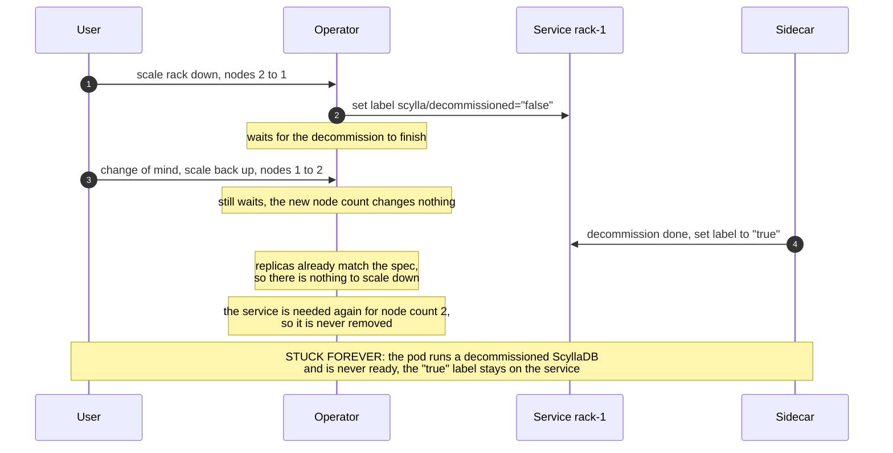
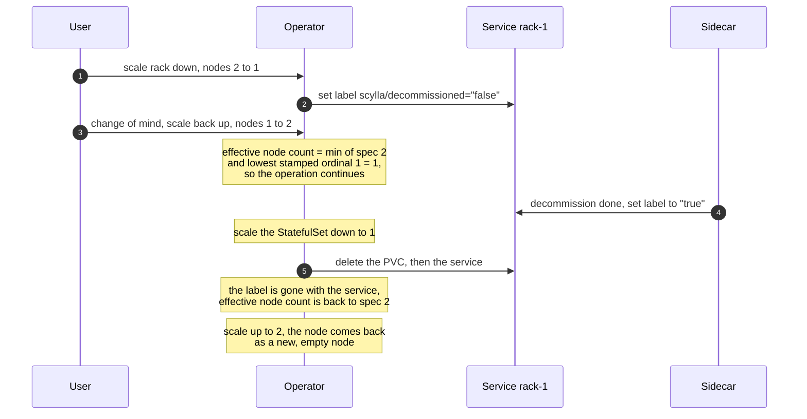

# Node count changes during an ongoing decommission (OPERATOR-327)

## TLDR

When a user scales a rack down, the operator decommissions nodes. Today, if the user changes the node count again before the decommission finishes, the rack gets stuck forever ([OPERATOR-343](https://scylladb.atlassian.net/browse/OPERATOR-343)).

One rule is proposed: **once a node's decommission has started, it must finish**. The node is fully removed, together with its service and PVC. Only then the new node count is applied. Capacity that comes back is added as new, empty nodes.

The simplest version of this rule is already implemented and tested in [PR #3603](https://github.com/scylladb/scylla-operator/pull/3603). It uses only the existing decommission labels.

Decisions to make:

1. Do we add a dedicated status field on top of the labels? It gives us a single commit point, visible progress, and webhook warnings — but the labels-based logic must exist anyway as the recovery path.
2. Do we add a sanity check before deleting the PVC of a node marked as decommissioned (see Risks)?

## Problem

The operator asks a node to decommission by setting the `scylla/decommissioned=false` label on its member service. The sidecar runs `nodetool decommission` and sets the label to `true` when done.

**The contract: once a service is stamped with the decommission label, we must assume the node was (or will be) decommissioned. There is no way to stop or revoke this operation.** ScyllaDB cannot cancel a running decommission, and the operator can never be sure the sidecar has not started it yet.

Today, if the user raises the node count back during an ongoing decommission, the rack gets stuck forever:



The pod keeps running a decommissioned ScyllaDB and never becomes ready. Nothing ever removes the label. Even worse: the leftover `"true"` label makes the next scale-down of this node skip the decommission completely (see Risks).

## Proposed solution: effective node count from labels

One rule, used everywhere instead of the spec node count (StatefulSet replicas, member services, scale target):

```
effective node count = min(spec node count, lowest ordinal with the decommission label)
```

With this rule, a stamped node always finishes its decommission and is fully removed (service and PVC). The label disappears together with the service. Only then the new node count can apply, and a node added back starts as a new, empty node:



Reference implementation: [PR #3603](https://github.com/scylladb/scylla-operator/pull/3603) (fixes OPERATOR-343). The envtests that reproduce the bug and verify the fix are in [`scylladbdatacenter_decommission_test.go`](https://github.com/czeslavo/scylla-operator/blob/fix/scale-up-during-decommission/test/envtest/controllers/scylladbdatacenter_decommission_test.go): one baseline scale-down spec, and one spec that scales the rack back up in the middle of a decommission.

This works the same for parallel decommissioning. Instead of one label at a time, we stamp all services from the target ordinal up to the current replicas — the rule does not change.

**Why the lowest ordinal must be stamped first:** stamping several services is not one atomic step. If we stamp the lowest ordinal first, the very first write already defines the full target of the operation. If we crash in the middle, recovery is simple: stamp all missing services between the lowest stamped ordinal and the current replicas. If we stamped from the top instead, a crash in the middle would commit only a part of the operation, and the final target would depend on how far the stamping got.

## Alternative (improved): dedicated status field

Store the operation in the rack status **before** stamping anything:

```yaml
status:
  racks:
  - name: a
    decommission:       # present only while a scale-down is in progress
      desiredNodes: 1   # the committed target, frozen until the operation finishes
```

What we get:

- **Single commit point.** One status write defines the target. We do not depend on the stamping order or on repair rules after a crash.
- **Single release point.** The new node count applies only after all stamped services are pruned. With labels only, if pruning fails halfway, the node count can go back up in small steps, with one extra node bootstrap per step.
- **Visible progress.** Users and support can see the ongoing operation and its target in the status.
- **Webhook warnings.** On a node count change during an operation, the webhook can warn: "this change will apply after the ongoing scale-down finishes".

What we pay:

- A new API field (v1alpha1 rack status; a v1 projection to decide on).
- The labels-based rule must be implemented anyway. It is the recovery path when the status is lost (backup restore, manual edits), and it protects us when the labels say something different than the record — a stamped node must never come back into the required range.

PoC: [`poc/decommission-status-gating` (diff against master)](https://github.com/scylladb/scylla-operator/compare/master...czeslavo:scylla-operator:poc/decommission-status-gating).

## Edge cases taken into account

- **Node count changed during an operation (up or down).** Applied only after the operation finishes. Then it is a normal scale-up or a new scale-down.
- **Operator crash in the middle of stamping.** The target is recovered from the lowest stamped ordinal, and the missing labels are stamped again.
- **Pruning fails halfway.** Each service is retried on its own. The PVC is always deleted before the service, so a node added back can never see old data.
- **Status lost or restored from an old backup.** The record is rebuilt from the labels, and the labels always win when they say a lower number — a stamped node is leaving no matter what the record says.
- **Operator upgrade during a decommission.** The in-flight operation looks like a stamped service with no record, so it is picked up and finished the same way.

## Risks

**Carried-over `decommissioned=true` labels.** [Issue #3539](https://github.com/scylladb/scylla-operator/issues/3539) shows that clusters in the wild can have a *healthy* node whose service carries a stale `"true"` label (left there by the bug above, plus manual recovery). After the fix, the operator removes such nodes and deletes their PVCs **right after the upgrade, without any user action**. For a real decommission leftover this is correct self-healing. For a healthy node that someone recovered by hand, it destroys its data.

Decision to make: do we guard against this with a sanity check — before deleting the PVC of a `"true"`-labeled node, check that the node is no longer a member of the cluster (for example, using the nodes status reports)? If the check cannot confirm the node has left, refuse to prune and report `Degraded`.
