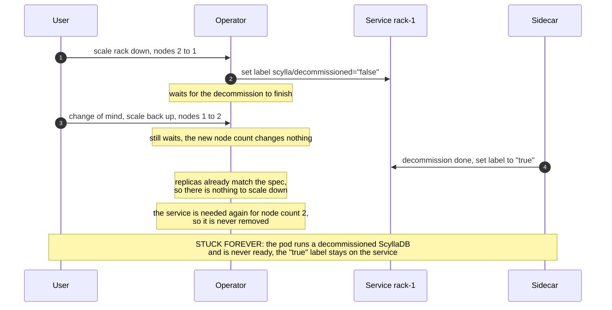
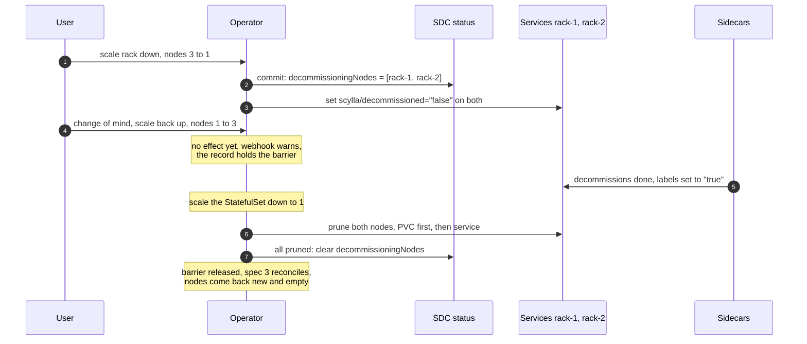

# Node count changes during an ongoing decommission (OPERATOR-327)

## TLDR

When a user scales a rack down, the operator decommissions nodes. Today, if the user changes the node count again before the decommission finishes, the rack gets stuck forever ([OPERATOR-343](https://scylladb.atlassian.net/browse/OPERATOR-343)).

One rule is proposed, defined per node: **once a node's decommission has started, that node must finish leaving**. It is fully removed, together with its service and PVC, and its identity must not be used again before that. Only then the new node count is applied. Capacity that comes back is added as new, empty nodes.

The proposed design records the leaving nodes in a per-rack status field before any decommission starts, and uses that record as a barrier until they are fully removed.

The barrier blocks the whole rack only because we use StatefulSets today: a StatefulSet can only remove its highest-numbered node, so leaving nodes and new nodes cannot coexist in a rack. The rule itself is per node, and the design is ready for a future move away from StatefulSets, where the barrier shrinks to single nodes and a rack can scale out while other nodes are still leaving.

## Problem

The operator asks a node to decommission by setting the `scylla/decommissioned=false` label on its member service. The sidecar runs `nodetool decommission` and sets the label to `true` when done.

**The contract: once a service is stamped with the decommission label, we must assume the node was (or will be) decommissioned. The operator cannot revoke this operation.** ScyllaDB cannot cancel a running decommission, and the operator can never be sure the sidecar has not started it yet.

Today, if the user raises the node count back during an ongoing decommission, the rack gets stuck forever:



The pod keeps running a decommissioned ScyllaDB and never becomes ready. Nothing ever removes the label. Even worse: the leftover `"true"` label makes the next scale-down of this node skip the decommission completely (see Risks and mitigations).

## The core invariant, and why it becomes a rack-level barrier

The durable part of this design is a **node-level** invariant:

> A node whose decommission intent is recorded is *leaving*. It must complete its decommission and be fully cleaned up (service and PVC deleted) before its identity may exist again. Nothing may re-include a leaving node in the desired set.

With the current StatefulSet backend, this invariant forces a **rack-level** barrier. A StatefulSet identifies nodes by ordinals `0..N-1` and can only remove the highest ordinal. So the leaving nodes must stay at the top of the range until they are removed. If we allowed a scale-out while a node is leaving, the new node would be created *above* the leaving one — and the leaving one could never be removed without also removing the newer, healthy node. This is why, with StatefulSets, a rack cannot scale out while a scale-in is in progress.

The rack barrier is therefore a consequence of the StatefulSet backend. It does not prevent a future refactor from moving the barrier to the node level once we move away from StatefulSets. See "Readiness for heterogeneous nodes in a rack" below.

## Proposed solution: a per-rack record of leaving nodes

Before any decommission starts, the operator records which nodes are going to leave — a **set of node identities** (member service names) in the rack status:

```yaml
status:
  racks:
  - name: a
    decommissioningNodes:   # present only while a scale-down is in progress
    - name: basic-dc-a-1
    - name: basic-dc-a-2
```

Each entry is an object rather than a bare name, so per-node metadata can be added later without another API change. The list is keyed by `name` (`listType=map`), so concurrent writers merge per entry instead of clobbering the whole list. The order of the entries carries no meaning and no logic may depend on it — entries are kept sorted only so that a reshuffle doesn't produce an endless stream of status updates.

The same record is mirrored into the `ScyllaCluster` API as `status.racks[].decommissioningMembers`, following the members vocabulary that API already uses for its rack status.

The record is a write-ahead log of the decommission labels: it says exactly which nodes are leaving, in the same language as the labels. Its meaning is defined per node ("these identities are leaving and must be fully removed before they may exist again") — it never mentions ordinals or StatefulSets.

The lifecycle:

1. **Commit.** On a scale-down, add the leaving node names to the set in a single status write — before touching any service. This one write defines the full operation, no matter what happens later.
2. **Stamp.** Set `scylla/decommissioned=false` on the listed services, lowest ordinal first.
3. **Barrier.** While a rack has decommissioning nodes recorded, the rack reconciles as if its node count excluded them. Spec changes (up or down) are accepted but wait. This is surfaced as a `Progressing` condition, an event, and a webhook warning on update ("this change will apply after the ongoing scale-down finishes"). The barrier is per rack: other racks keep reconciling.
4. **Conclude.** When all listed nodes report `"true"`: scale the StatefulSet down, prune each node (PVC first, then service), and remove fully pruned nodes from the set. When the set is empty, the barrier releases in one step: the (possibly changed) spec reconciles, and returning capacity bootstraps as new, empty nodes.



The decommission labels stay the ground truth underneath the record: if the record and the labels ever disagree, the labels win — a stamped node is irrevocably leaving, no matter what the record says. And a lost record (a restored backup, manual edits) is simply rebuilt from the labels.

The design works the same for parallel decommissioning: with `spec.enableParallelNodeOperations` enabled, all the listed nodes are stamped and decommissioned at once instead of one at a time — nothing about the record or the lifecycle changes.

## Readiness for heterogeneous nodes in a rack

If racks get non-homogeneous nodes (each node individually defined, with its own identity), the design adapts instead of breaking:

- The node-level invariant stays the same: a leaving node must finish and be cleaned up before its identity may exist again.
- The rack barrier dissolves. A new node gets a fresh identity, so **scale-out during an ongoing decommission becomes allowed** — there is no ordinal range to conflict with. The barrier shrinks to a per-node tombstone: "an entry for a leaving identity is not reconcilable until its cleanup completes."
- The decommission label is already per-node, so it carries over as-is. The `decommissioningNodes` set keeps its meaning; only the "must be a suffix" constraint disappears, and reshaping the field itself is cheap because it can always be rebuilt from the labels. Per-node operations are also naturally atomic (one write per node), so the commit-atomicity value of the record shrinks — its long-term value is observability and warnings.

## Risks and mitigations

### Carried-over `decommissioned=true` labels

[Issue #3539](https://github.com/scylladb/scylla-operator/issues/3539) shows that clusters in the wild can have a *healthy* node whose service carries a stale `"true"` label. The label was correct when the sidecar wrote it — the sidecar only sets `"true"` after the node really reached the `Decommissioned` mode. It became stale later: either the operator itself left it behind (a scale-out landing during cleanup, between the PVC and service deletion), or the node was recovered by hand while the label stayed on the service. After the fix, the operator removes such nodes and deletes their PVCs **right after the upgrade, without any user action**. For a real decommission leftover this is correct self-healing. For a healthy, recovered node it destroys its data.

Mitigation comes in layers:

1. **Going forward, the design itself closes the source.** The barrier releases only after the decommissioned services are pruned, so a `"true"` label can no longer outlive its scale-down. New stale labels cannot be created by the operator.
2. **For the existing stale `decommissioned=true` nodes, a release note.** Before upgrading, users should check for leftover labels and remove the stale ones (a `"true"` label on a service whose node is healthy is stale):

   ```
   kubectl get svc -A -l scylla/decommissioned=true
   ```

### The barrier can trap a decommission that ScyllaDB keeps rejecting

With rack-aware replication (tablets keyspaces using rack lists), a leaving node's replicas can only move to other nodes of the *same* rack. If the rack has no room for them — not enough nodes or disk — ScyllaDB keeps rejecting the decommission, and the operation waits forever. The cluster stays healthy (the leaving node keeps running and serving), but both ways out are blocked by our own design: adding a node to the rack is impossible with StatefulSets (a new node cannot be created above the leaving ones), and reverting the scale-down is exactly what the barrier defers.

The problem exists today too, with no documented remedy — and today the decommission wait blocks the whole datacenter, so the design narrows the risk rather than creating it. But today's undocumented way out (manually removing the label) stops working: the record and the labels rebuild each other, so hand-editing either one is undone by the controller.

Handling this explicitly would need an escape hatch — for example, a `scylla/decommission-abort=true` label on the member service: the *sidecar* safely drops `decommissioned=false` between attempts (only it can do this without a race, and it ignores the abort if the node already left), and the *controller* then drops the node from `decommissioningNodes` and does not re-stamp a service carrying the abort label.

The escape hatch is only needed for as long as we use StatefulSets: with non-StatefulSet node management, a new node can simply be added to the rack, and the stuck decommission proceeds on its own. **Decided: the escape hatch is out of scope for this design and is postponed until node management moves away from StatefulSets.** Until then the risk is accepted — it exists today as well, and the cluster stays healthy while the decommission waits.
