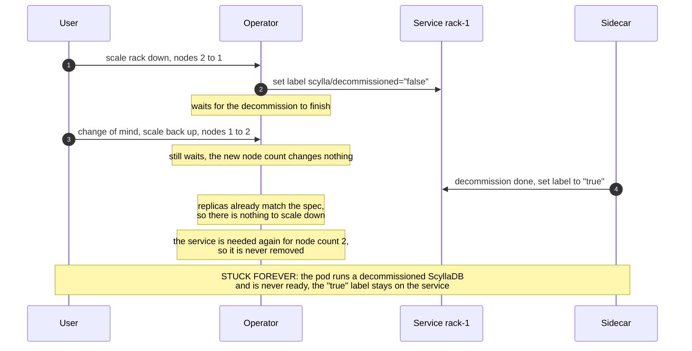
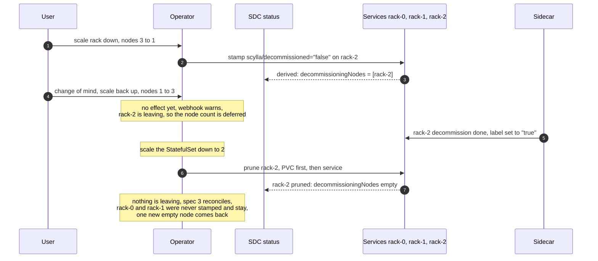

# Node count changes during an ongoing decommission (OPERATOR-327)

## TLDR

When a user scales a rack down, the operator decommissions nodes. Today, if the user changes the node count again before the decommission finishes, the rack gets stuck forever ([OPERATOR-343](https://scylladb.atlassian.net/browse/OPERATOR-343)).

One rule is proposed, defined per node: **once a node's decommission has started, that node must finish leaving**. It is fully removed, together with its service and PVC, and its identity must not be used again before that. Only then the new node count is applied. Capacity that comes back is added as new, empty nodes.

The design makes the decommission labels on the member services the single source of truth for which nodes are leaving, and holds the rack's node count until every leaving node is fully removed. A per-rack status field lists the leaving nodes as a view derived from those labels, for observability and for admission checks.

The barrier blocks the whole rack only because we use StatefulSets today: a StatefulSet can only remove its highest-numbered node, so leaving nodes and new nodes cannot coexist in a rack. The rule itself is per node, and the design is ready for a future move away from StatefulSets, where the barrier shrinks to single nodes and a rack can scale out while other nodes are still leaving.

## Problem

The operator asks a node to decommission by setting the `scylla/decommissioned=false` label on its member service. The sidecar runs `nodetool decommission` and sets the label to `true` when done.

**The contract: once a service is stamped with the decommission label, we must assume the node was (or will be) decommissioned. The operator cannot revoke this operation.** ScyllaDB cannot cancel a running decommission, and the operator can never be sure the sidecar has not started it yet.

Today, if the user raises the node count back during an ongoing decommission, the rack gets stuck forever:



The pod keeps running a decommissioned ScyllaDB and never becomes ready. Nothing ever removes the label. Even worse: the leftover `"true"` label makes the next scale-down of this node skip the decommission completely (see Risks and mitigations).

## The core invariant, and why it becomes a rack-level barrier

The durable part of this design is a **node-level** invariant:

> A node whose decommission has been requested — its member service stamped with the decommission label — is *leaving*. It must complete its decommission and be fully cleaned up (service and PVC deleted) before its identity may exist again. Nothing may re-include a leaving node in the desired set.

With the current StatefulSet backend, this invariant forces a **rack-level** barrier. A StatefulSet identifies nodes by ordinals `0..N-1` and can only remove the highest ordinal. So the leaving nodes must stay at the top of the range until they are removed. If we allowed a scale-out while a node is leaving, the new node would be created *above* the leaving one — and the leaving one could never be removed without also removing the newer, healthy node. This is why, with StatefulSets, a rack cannot scale out while a scale-in is in progress.

The rack barrier is therefore a consequence of the StatefulSet backend. It does not prevent a future refactor from moving the barrier to the node level once we move away from StatefulSets. See "Readiness for heterogeneous nodes in a rack" below.

## Solution: the labels are the source of truth, the status is a view of them

The nodes of a rack that are leaving the cluster are exactly the ones whose member service carries the `scylla/decommissioned` label, whatever its value — `false` while the decommission is running, `true` once it is done. That **set of node identities** (member service names) is surfaced in the rack status:

```yaml
status:
  racks:
  - name: a
    decommissioningNodes:   # present only while nodes of this rack are leaving the cluster
    - name: basic-dc-a-1
```

The field is never written directly. It is derived on every sync from the labels: a node is listed from the moment its decommission is requested until its service is pruned. It carries no state and needs no reconciliation.

Each entry is an object rather than a bare name, so per-node metadata can be added later without another API change. The list is keyed by `name` (`listType=map`). The order of the entries carries no meaning and no logic may depend on it — entries are kept sorted only so that a reshuffle doesn't produce an endless stream of status updates.

The same view is mirrored into the `ScyllaCluster` API as `status.racks[].decommissioningMembers`, following the members vocabulary that API already uses for its rack status, together with a `MemberLeaving` rack condition set while the list is non-empty.

The view says exactly which nodes are leaving. Its meaning is defined per node ("these identities are leaving and must be fully removed before they may exist again") — it never mentions ordinals or StatefulSets. It exists for observability and for the admission webhook, which reads `old.Status` to refuse removing a rack that still has nodes leaving, and to warn that a node count change will be deferred. The barrier itself reads the labels, not the status.

A leaving node goes through the following lifecycle. How many nodes go through it together depends on `spec.enableParallelNodeOperations`, see "Parallel decommissioning" below.

1. **Stamp.** On a scale-down, request the decommission of the rack's highest node by setting `scylla/decommissioned=false` on its member service. From that moment it is leaving, and the status lists it.
2. **Wait.** The node's sidecar runs the decommission and flips the label to `true`.
3. **Conclude.** Scale the StatefulSet below the node.
4. **Prune.** Delete the node's PVC, then its service. The node drops out of the view together with its service, and the rack is released once none of its nodes is leaving.

While any node of a rack is leaving, the rack is held: **the count it drives towards is its spec node count, lowered to the lowest leaving ordinal**. The two directions therefore behave differently, and only one of them waits.

A **raised** count is deferred until the leaving nodes are pruned. The capacity coming back can only bootstrap as new nodes once their identities are gone, and a StatefulSet cannot add a node above a leaving one anyway. This is the deferral the design is about: it is reported with the `DeferringRackNodeCountChange` reason in the `Progressing` condition, and the admission webhook warns on the update that the count is accepted but won't apply until the leaving nodes are gone.

A **lowered** count applies right away and extends the ongoing scale-down: the nodes it uncovers join the ones already leaving, which keeps the leaving nodes a suffix of the rack, so nothing has to wait. No deferral is reported and no warning is issued — there is nothing deferred to report.

The `Progressing` condition also reports where a leaving node stands: `WaitingForRackServiceDecommission` while the sidecar is decommissioning it, and `WaitingForRackServicePruning` once it has been scaled away but its service is not pruned yet.

How far the hold reaches across *racks* depends on the mode; see "Parallel decommissioning" below. What it covers does not: in both modes a leaving node anywhere in the datacenter also holds back pod template updates and upgrades for all of it, so that a rolling restart is never mixed with a topology change. Only the pruning of the leaving services runs outside the hold, in its own sync step, which is what lets the barrier release at all.



There is no second source of truth to keep in sync. The status cannot disagree with the labels, because it is computed from them on every sync: a status lost or altered out of band — a restored backup, a manual edit — is recomputed on the next one, and a stamped node stays irrevocably leaving whatever any status said about it.

Because the labels define the set, the nodes that end up leaving are the ones that were already stamped when the spec changed — never more than what the scale-down asked for. Nodes are always stamped from the highest ordinal down, so a revert keeps every node that has not been stamped yet: if a scale-down by two nodes is reverted while the first one is leaving, only that node leaves, and the reverted count applies as soon as it is pruned.

Removing a rack outright is a separate hazard. Admission already refuses to remove a rack whose status still reports nodes, but that count mirrors the StatefulSet replicas, which reach zero one step before the last leaving node is pruned. A rack removed in that window leaves the controller unable to resolve the rack of the orphaned service, so the service and its PVC are never cleaned up. Admission therefore also **forbids** removing a rack whose status still lists leaving nodes, and names them in the error.

### Parallel decommissioning

`spec.enableParallelNodeOperations` controls how nodes are started, and it selects how they leave as well. The labels stay the source of truth, the lifecycle steps are unchanged, and nodes are stamped from the highest ordinal down either way. What differs is how many nodes go through the lifecycle together, and how far the hold reaches:

- **Disabled.** One node at a time: only the highest node is stamped, and the next one is not requested until it has finished decommissioning. The hold covers the whole datacenter — one node operation at a time across every rack.
- **Enabled.** Every node above the target count is stamped in one pass, highest ordinal first, and they decommission concurrently. The hold covers only the rack it applies to: racks no longer wait for each other, so several of them can be decommissioning at the same time.

Scaling the StatefulSet down is greedy in both modes: the rack scales below the run of decommissioned nodes at its top as soon as there is one, rather than waiting for every leaving node. It has to be a run counted from the top, because a StatefulSet only removes its highest ordinals. Removing a node early matters — a decommissioned node has left the cluster and its Pod never becomes ready again, so until it is gone it holds its resources and counts against the PodDisruptionBudget while the nodes below it are still leaving.

The mode therefore decides how much concurrency a scale-down gets, not which nodes it takes. That is deliberate. A concurrency knob that also changed which nodes are destroyed on a change of mind would be a poor one, so both modes stamp from the top down and share a single rule: a node that has not been stamped yet is saved by a revert. It also keeps the leaving set as small as the operation allows, which matters because a decommission cannot be taken back, while a scale-down can always be re-issued.

A pass is not a commitment either, and that is the point of requesting from the top down. Requesting a node is irrevocable — it always finishes leaving — but a pass cut short, by a controller restart say, has only requested the nodes above the ones it didn't reach. If the count stays lowered, the next sync simply resumes the pass. If it is raised back, every node not yet requested is saved, and the raised count applies once the requested ones are pruned. Requesting bottom-up would instead pin the whole scale-down on its first request and decommission, on a revert, nodes the user had already asked to keep. A member service missing from the caches doesn't leave a pass half done: the whole range is checked before any node is requested.

## Readiness for heterogeneous nodes in a rack

If racks get non-homogeneous nodes (each node individually defined, with its own identity), the design adapts instead of breaking:

- The node-level invariant stays the same: a leaving node must finish and be cleaned up before its identity may exist again.
- The rack barrier dissolves. A new node gets a fresh identity, so **scale-out during an ongoing decommission becomes allowed** — there is no ordinal range to conflict with. The barrier shrinks to a per-node tombstone: "a stamped identity is not reconcilable until its cleanup completes."
- The decommission label is already per-node, so it carries over as-is. The `decommissioningNodes` view keeps its meaning; only the "must be a suffix" constraint disappears, and reshaping the field itself is cheap because it holds no state and is always recomputed from the labels.

## Risks and mitigations

### Carried-over `decommissioned=true` labels

[Issue #3539](https://github.com/scylladb/scylla-operator/issues/3539) shows that clusters in the wild can have a *healthy* node whose service carries a stale `"true"` label. The label was correct when the sidecar wrote it — the sidecar only sets `"true"` after the node really reached the `Decommissioned` mode. It became stale later: either the operator itself left it behind (a scale-out landing during cleanup, between the PVC and service deletion), or the node was recovered by hand while the label stayed on the service.

After the fix, such a node is leaving by definition, and the rack acts on it without any user action. The blast radius is not limited to that node: a service below the StatefulSet's replicas cannot be pruned yet, so the rack drains down to the stale node, taking out every healthy node above it — one at a time, or all at once with parallel node operations enabled. Those nodes leave properly, streaming their data to the remaining ones. The stale node does not. Its service already carries the label, so the stamp step is skipped for it: it is scaled away and its PVC deleted **without any decommission**. Because the spec node count never changed, the rack then grows back to it, and every node that was drained comes back new and empty.

On a stale leftover that is what should happen. On a node that was recovered by hand and rejoined the ring, it deletes a live member with neither a decommission nor a `removenode`, so its data is gone and ScyllaDB keeps a phantom entry for it in the ring. **That entry has to be removed by hand, with `nodetool removenode`** — nothing in the operator does it, and until it is gone the cluster believes it still owns tokens.

A `"false"` label at a low ordinal, however it got there, drains the rack the same way, except that this node does decommission properly, because its sidecar has a request to act on. It finishes first and the drain follows sequentially, or the two run alongside each other in parallel; either way that node's own service is pruned last. Both cases are the target rule above doing what it says: a label anywhere in a rack pulls every node above it out of the cluster. Those nodes cannot simply be left in place — a StatefulSet removes only its highest ordinal, so a leaving node below them is removed either by taking them out first or by scaling them away undecommissioned, and the latter is worse.

Mitigation comes in layers:

1. **Going forward, the design itself closes the source.** The barrier releases only after the decommissioned services are pruned, so a `"true"` label can no longer outlive its scale-down. New stale labels cannot be created by the operator.
2. **For the existing stale `decommissioned=true` nodes, a release note describing the whole effect** — not just the loss of one node's PVC, but the drain of every node above it, the return of the rack as new empty nodes, and the `nodetool removenode` left for the user. Before upgrading, users should check for leftover labels and remove the stale ones (a `"true"` label on a service whose node is healthy is stale):

   ```
   kubectl get svc -A -l scylla/decommissioned=true
   ```

### The barrier can trap a decommission that ScyllaDB keeps rejecting

With rack-aware replication (tablets keyspaces using rack lists), a leaving node's replicas can only move to other nodes of the *same* rack. If the rack has no room for them — not enough nodes or disk — ScyllaDB keeps rejecting the decommission, and the operation waits forever. The cluster stays healthy (the leaving node keeps running and serving), but both ways out are blocked by our own design: adding a node to the rack is impossible with StatefulSets (a new node cannot be created above the leaving ones), and reverting the scale-down is exactly what the barrier defers.

The problem exists today too, with no documented remedy, so the design does not create it — and with parallel node operations enabled it narrows it, since only the affected rack is held instead of the whole datacenter. Today's undocumented way out keeps working: removing the `decommissioned=false` label by hand drops the node from the leaving set, and if the node count is raised back at the same time, the node stays. Stripping the label alone is not enough — stamping is triggered by the label being absent, so while the rack still asks for fewer nodes the next pass stamps the node again. And it stays as unsafe as it is undocumented — ScyllaDB may already be mid-decommission, and neither the operator nor the user editing the label can tell.

Handling this *safely* would need an escape hatch — for example, a `scylla/decommission-abort=true` label on the member service: the *sidecar* drops `decommissioned=false` between attempts (only it can do this without a race, and it ignores the abort if the node already left), and the *controller* does not re-stamp a service carrying the abort label. That is exactly what the manual label removal cannot give: a moment at which dropping the label is known to be safe.

The escape hatch is only needed for as long as we use StatefulSets: with non-StatefulSet node management, a new node can simply be added to the rack, and the stuck decommission proceeds on its own. **Decided: the escape hatch is out of scope for this design and is postponed until node management moves away from StatefulSets.** Until then the risk is accepted — it exists today as well, the cluster stays healthy while the decommission waits, and removing the label by hand remains available at the user's own risk.

### A stale cache can let a scale-up race a scale-down

The scale decision reads the rack's member services from the informer cache. A label stamped in one sync may not be visible in the next, so a scale-up racing a scale-down could create a node with an ordinal above a node that is already leaving — the very situation the barrier exists to prevent.

The exposure is pre-existing: today's decommission wait reads the same labels from the same cache. How to close it is not decided. The candidates are a live (quorum) read of the rack's member services before acting on a scale decision, or controller-side expectations. It is tracked in [OPERATOR-369](https://scylladb.atlassian.net/browse/OPERATOR-369).
